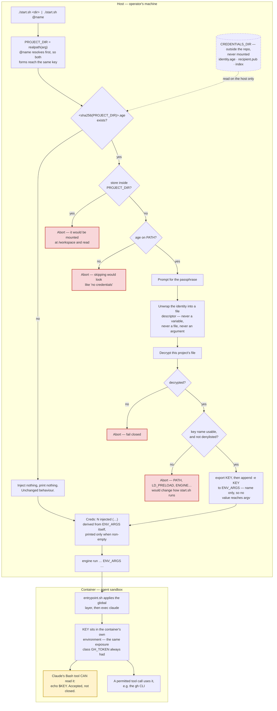

# Per-Project Encrypted Credential Store

## Status
Draft

## Context

Issue #129 asks that `start.sh` stop taking its one credential from whatever
the launching shell happens to hold. Planning closed on 2026-09-20 with four
Approved artifacts in `docs/planning/0129-encrypted-credential-store/`, and
`docs/planning/0129-encrypted-credential-store/charter.md` §Decision records a
go on 2026-09-21.

This document does not restate that bundle
([ADR 002](../adr/002-planning-artifact-contract.md) decision 6). What it owes
the charter is three things: the mechanics the charter left to Design, the
backup and recovery procedure its §Recommendation makes a binding condition,
and the tiering policy its §Open questions asks to decide early.

### What is missing

`start.sh:235-238` builds `ENV_ARGS` as a name-only `-e GH_TOKEN`, conditional
on `GH_TOKEN` already being set. That mechanism is sound — the value never
reaches host argv, so it is absent from `ps` and from shell history. The
problem is only its source.

### One correction to the approved scope

`docs/planning/0129-encrypted-credential-store/scope.md` §Constraints places
the store in a gitignored `credentials/` directory, and issue #129 says the
same. **That location is unsafe for this project specifically, and this design
rejects it.**

`start.sh:231-233` bind-mounts `PROJECT_DIR` at `/workspace`. When an operator
opens a session on the claude-sandbox repository itself — routine, and how this
document was written — `PROJECT_DIR` *is* `SANDBOX_DIR`. A store at
`${SANDBOX_DIR}/credentials/` is then mounted at `/workspace/credentials/` and
is read directly by the agent's own Bash tool: ciphertext, the
passphrase-wrapped identity, and the plaintext hash-to-path index together.
`.gitignore` does not help, because it governs tracking and the exposure is
mounting.

`docs/claude-code-security-plan.md` §Phase 4 already states the governing rule
— *never mount the directory containing it* — and calls physical absence "the
strongest possible control: not a permission check that could be
misconfigured, but a physical absence of the data from the container's
filesystem namespace." An in-repo store contradicts that rule in the one case
where it matters most.

## Decision

### Store location

The store lives outside the repository, at a path resolved through the
existing four-layer config mechanism
(`docs/designs/0028-sandbox-config-file.md`):

| Layer | Value |
|---|---|
| 1 — hardcoded default | `${XDG_DATA_HOME:-$HOME/.local/share}/claude-sandbox/credentials` |
| 2 — `config.sh` | may override project-wide |
| 3 — `config.local.sh` | may override per machine |
| 4 — environment | `CREDENTIALS_DIR` wins |

Layering it rather than hardcoding it is what makes the store testable: a bats
fixture points `CREDENTIALS_DIR` at its own temp directory and never touches
the operator's real store.

**Defence in depth.** `start.sh` aborts if the resolved store lies inside
`PROJECT_DIR`, whatever the config says. The default location makes the
exposure impossible; the guard makes an operator override fail loudly instead
of silently handing the store to the agent. A `credentials/` line is still
added to `.gitignore`, for an operator who points the store at the repo anyway.

### Store layout

```
$CREDENTIALS_DIR/
  identity.age    # X25519 identity, scrypt-wrapped with the passphrase
  recipient.pub   # the identity's public key; not sensitive
  index           # <hash>  <project path>, so `creds.sh list` is readable
  <hash>.age      # one per credentialed project, encrypted to recipient.pub
```

`index` discloses which projects hold credentials, which is exactly the
disclosure that keeps the store untracked. It is acceptable on the host — the
information is already implicit in the filenames — and it never enters a
container.

### File format

Decrypted plaintext is `KEY=value`, one per line. Blank lines and lines whose
first non-space character is `#` are skipped. Everything after the first `=`
is the value, so values may contain `=`.

Key names must match `[A-Za-z_][A-Za-z0-9_]*`, and a small denylist is
rejected outright: `PATH`, `LD_PRELOAD`, `LD_LIBRARY_PATH`, `IFS`, `BASH_ENV`,
`ENV`, `SHELLOPTS`, `BASHOPTS`, and every variable `start.sh` reads for itself
(`ENGINE`, `IMAGE_PREFIX`, `CREDENTIALS_DIR`, the `MAIN_*` and `PROXY_*` set).

This is a control against operator error, not against an attacker. A hostile
store implies a compromised host, which
`docs/planning/0129-encrypted-credential-store/scope.md` §Non-goals puts out of
scope. But a credential accidentally named `PATH` would be exported into
`start.sh`'s own process before it invokes the engine, and that failure is
cheap to make impossible.

### Path-hash keying

The filename is `sha256sum` over the resolved `PROJECT_DIR` from
`start.sh:146`. Because `@name` resolution at `start.sh:117-144` runs *before*
`realpath`, `./start.sh @mylib` and `./start.sh ~/projects/mylib` land on the
same hash with no special-casing — the property
`docs/planning/0129-encrypted-credential-store/feasibility.md` §Technical
identifies.

Hashing rather than transliterating the path avoids delimiter collisions and
filename length limits, at the cost of opacity; `index` and `creds.sh list`
buy the readability back.

Renaming or moving a project directory orphans its credential file. The
session then starts with no credentials rather than failing, which is correct
— it is indistinguishable from a project that never had any — and
`creds.sh migrate` re-keys the file.

### Identity and passphrase model

One identity for the whole store, not one passphrase per file. Per-file
passphrases mean either one shared secret with extra ceremony or an
unmanageable set.

- `creds.sh init` generates an X25519 identity, writes the public key to
  `recipient.pub` in the clear, and wraps the private identity with a
  passphrase into `identity.age`.
- Every credential file is encrypted to `recipient.pub`, so **writing needs
  only the public key**. Adding the *first* credential for a project prompts
  for nothing. Adding a second one does prompt, because a project's
  credentials share one file and the existing ciphertext has to be read before
  it can be rewritten. One file per credential would avoid that, at the cost
  of unwrapping the identity once per credential at launch — the wrong side of
  the trade, since launch is the hot path and the identity would have to be
  held in a variable to be reused.
- `start.sh` unlocks `identity.age` through process substitution and pipes it
  straight into the decryption of `<hash>.age`. The unwrapped identity exists
  only as a file descriptor in `start.sh`'s process; it is never written to
  disk, never placed in a variable, and never appears in argv.

The passphrase is typed once per launch of a credentialed project. A project
with no credential file prompts for nothing, so the common case is unchanged.

### `start.sh` integration

A new block immediately after the `ENV_ARGS` construction at
`start.sh:242-245` and before the global-layer mounts at `:347`. It sits
before `trap cleanup EXIT` at `:372` deliberately: an abort there has no proxy
container to tear down.

1. Compute `CRED_FILE` from the hash of `PROJECT_DIR`.
2. If `CRED_FILE` does not exist, do nothing and print nothing. This is
   today's behaviour for a project with no credentials and it must stay
   silent.
3. Abort if the resolved store lies inside `PROJECT_DIR`.
4. Abort if `age` is not on `PATH`. A missing binary must not degrade to "no
   credentials injected", or the failure becomes indistinguishable from step 2
   — the risk `docs/planning/0129-encrypted-credential-store/feasibility.md`
   §Risk inventory names.
5. Decrypt in one command substitution, no temporary file. On failure, abort,
   mirroring the Squid precedent at `start.sh:394-405` in shape: one `Error:`
   line, one line citing the document that mandates fail-closed, `exit 1`.
6. Parse, validate each key, `export` it, and append `("-e" "$KEY")` to
   `ENV_ARGS`.
7. Unset the plaintext.

Steps 3 through 6 are all fail-closed. Only step 2 is silent, and only because
silence there is the existing contract.

The same flow as a picture, for the branching the list above flattens. The
list stays because mermaid does not render in a terminal, which is where both
the operator and an agent read this most often (issue #99 §Trade-offs on
record).



The yellow node is the residual risk §Security analysis states: everything
left of `J` is the work, and none of it changes what the agent can read once
the container is running.

### Operator feedback, and why it is a real assertion

`start.sh` gains one banner line, in the column alignment of `:190-204`:

```
Creds:    2 injected (GH_TOKEN, PYPI_TOKEN)
```

Names only. A value is never printed.

**The line is derived by walking `ENV_ARGS` itself** — every element that
follows a `-e` — rather than from a list accumulated during parsing. This is
not a stylistic choice. `tests/test_config.bats` drives `start.sh` under
`ENGINE=true`, which discards argv, so no `hostonly` test can observe `-e
GH_TOKEN` reaching the engine. Deriving the banner from the array that
`start.sh:305` expands is what makes a glob assertion on that line an
assertion about the array, and what stops the two drifting apart. A banner
built from a parallel list could report an injection that never happened.

The line also covers the pre-existing ambient-`GH_TOKEN` path at `:236-238`,
which has no test today.

### Key lifecycle: backup and recovery

`docs/planning/0129-encrypted-credential-store/charter.md` §Recommendation
makes this section a condition on the design, because
`docs/planning/0129-encrypted-credential-store/feasibility.md` §Risk inventory
rates a lost identity as unrecoverable rather than merely leaked — the one
failure here with no mitigation available afterwards.

**Backup.** `identity.age` is the whole store. It is already
passphrase-wrapped, so it is safe to copy anywhere the passphrase is not:
another machine, removable media, a password manager's file attachment. Back
it up at `creds.sh init` time, before any credential exists — a backup
deferred until the store is valuable is a backup that does not exist.
`creds.sh init` refuses to complete without printing the backup instruction.

**What a backup does not cover.** The passphrase. Store it separately, by
whatever means already protects the operator's other irreplaceable secrets.
Identity plus passphrase in the same place is one copy, not two.

**Recovery, from a lost host.** Restore `identity.age` to
`$CREDENTIALS_DIR/`, run `creds.sh init --recover` to regenerate
`recipient.pub` from it, restore the `<hash>.age` files and `index`, then
`creds.sh list` to confirm. Credential files are useless without the identity
and need no separate protection in transit.

**Recovery, from a lost identity or forgotten passphrase.** There is none.
Every credential in the store must be revoked at its issuer and reissued. This
is stated plainly because an operator discovering it during an incident is the
failure mode this section exists to prevent.

**Rotation.** `creds.sh rotate` generates a new identity, decrypts every
credential file with the old one, re-encrypts to the new public key, and
leaves the old identity in place as `identity.age.prev` until the operator
removes it. Rotation is therefore recoverable from an interruption.

### Sensitivity tiering policy

`docs/planning/0129-encrypted-credential-store/charter.md` §Open questions asks
to decide this early, and §Recommendation says a conclusion that nothing
beyond a repo-scoped token belongs in the store would overturn the project.
The policy is written here, before implementation, so that conclusion can
still act on it.

The mechanism is value-agnostic: it moves bytes into an environment variable
and never inspects them. The boundary is therefore policy, not capability.

| Tier | Rule | Examples |
|---|---|---|
| **Inject** | Scoped to one service, narrow in authority, and revocable without collateral damage. | A repo-scoped GitHub token, a project-specific registry token, a database URL for a disposable dev instance. |
| **Defer** | Legitimate to want, but the blast radius needs the agent not to hold the value at all. Blocked on the proxy-substitution follow-up. | Org-wide tokens, anything granting write access beyond the project in hand. |
| **Never** | Long-lived, broad, or standing in for the operator rather than the project. Kept manual, outside the store entirely. | Cloud root or org-admin credentials, an SSH private key as payload, signing keys, anything whose compromise is not contained by revoking one token. |

**The tier is a property of authority, not of secrecy.** Everything in the
store is a secret; the question the tiers answer is what a leak costs. The
residual risk below means every Inject-tier value must be assumed readable by
the agent, so "would I be comfortable if this value were printed into a
session transcript?" is the operative test.

**On the question this was meant to settle.** Tier Inject is not empty and not
a single credential. A repo-scoped token, a package-registry token and a dev
database URL are three distinct values for one project today, and the store's
per-project scoping is worth having for exactly that spread. The project is
not overturned.

**SSH private keys** are called out by name in tier Never. SSH reads a key
from disk, so delivering one means `base/entrypoint.sh` writing a long-lived,
broad-authority credential to a predictable path the agent can `cat` — the
worst profile for this threat model, and a named non-goal in
`docs/planning/0129-encrypted-credential-store/scope.md` §Non-goals. An SSH
key used as the store's *identity* is a different thing and was dropped in
favour of the passphrase, not rejected on these grounds.

### Security analysis (delta)

Full treatment belongs in the threat model, not here;
`docs/claude-code-security-plan.md` §Phase 4 is rewritten and Change 26 records
the delta. Three points are load-bearing for this design:

**Trust boundary.** Everything new happens in `start.sh`'s host process. The
container's interface is unchanged: it receives named environment variables
and nothing else. No new mount, no new file, no change to `base/entrypoint.sh`
or to any image.

**The residual risk is not closed.** The decrypted value lands in the
container's environment, where `echo $KEY` reaches it and `podman inspect`
shows it. That is not a regression — `GH_TOKEN` has this exposure today — but
`docs/planning/0129-encrypted-credential-store/scope.md` §Non-goals accepts it
knowingly rather than solving it. Saying so plainly is the control; the
tiering policy above is what bounds it.

**The divergence from OWASP guidance is deliberate.** OWASP's Docker Security
and Secrets Management cheat sheets prefer read-only file mounts to
environment variables, because env vars surface in `docker inspect`,
`/proc/self/environ` and process listings. That guidance assumes a human
attacker with daemon access. Here the adversary is the process inside the
container, for which a mounted file is strictly worse — directly readable by
the agent's own Bash tool, and a file that exists to be found. Stated here so
a reviewer meeting the standard advice does not read this as an oversight.

**On Case E.** `docs/designs/docs-as-code-workflow.md` §3 triggers Case E on
`base/Dockerfile`, `base/entrypoint.sh`, `squid/squid.conf` and the
`permissions` block in `settings.json`. `start.sh` is on none of them, so Case
E is not triggered and this is Case C. The STRIDE obligation is discharged
anyway, because Phase 4's description of the credential flow would otherwise
be false. Whether the trigger list should name `start.sh` is the open question
`docs/claude-code-security-plan.md` Change 25 already records, and it stays
there rather than being settled from inside a feature branch.

## Consequences

- A credential is scoped to one project. The blast radius of a compromised
  session is what that project needs, not what the operator's shell happened
  to hold.
- Plaintext leaves the operator's shell environment and shell history.
- `age` becomes a host prerequisite. Absence aborts any credentialed launch —
  loudly, by design — and is invisible to a project with no credentials.
- A passphrase prompt appears on every credentialed launch. There is no
  caching, and adding an agent to cache it would be a new daemon and a new
  thing to protect. Friction is the intended pressure toward a small store.
- Non-interactive invocation, including CI, becomes impossible for
  credentialed projects by construction, per
  `docs/planning/0129-encrypted-credential-store/scope.md` §Non-goals.
- `identity.age` becomes a single point of failure for the whole store,
  mitigated only by a procedure a person must actually perform.
- Three tests join the suite. CI runs the `hostonly` tier only, so they are
  written to need no container engine and no `age` binary; the 34 tests that
  never run in CI remain issue #101's problem, not this design's.
- The agent can still read every injected value. This design does not change
  that and does not claim to.

## Alternatives considered

**GPG with `pass`.** *Why it is attractive:* a decade of use, the canonical
answer for one-encrypted-file-per-secret, and the operator already has GPG
muscle memory from other work. *What breaks:* `pass` assumes a human browsing
a password tree, GPG brings a keyring daemon into a script that has none, and
`passage` — age's own author's fork of `pass` replacing exactly that backend —
settles the direction, per
`docs/planning/0129-encrypted-credential-store/prior-art.md` §Build vs adopt.

**SOPS with tracked ciphertext.** *Why it is attractive:* encrypted values
stay in a tracked repo with readable key names, diffs remain meaningful, and
multi-recipient access needs no redesign. *What breaks:* tracked filenames
disclose which projects hold which credentials, which
`docs/planning/0129-encrypted-credential-store/scope.md` §Constraints rules
out. SOPS also assumes a team-shared, frequently-diffed config; this is one
flat file per project, read by a launcher.

**`age` with an SSH key as the store identity.** *Why it is attractive:* it
creates no new secret, inherits whatever already guards `ssh-agent` (including
a hardware token), and unlocks once per shell session rather than once per
launch. *What breaks:* nothing technical — it was dropped in favour of the
passphrase and is recorded as dropped, not deferred, in
`docs/planning/0129-encrypted-credential-store/scope.md` §Non-goals. It stays
the strongest candidate if per-launch prompting proves too costly.

**A mounted secrets file under `/run/secrets/`.** *Why it is attractive:* it
is the mainstream container answer and keeps values out of `inspect` output.
*What breaks:* it is directly readable by the agent's Bash tool, which is this
project's actual adversary. Argued above.

**Transliterating the path instead of hashing it.** *Why it is attractive:*
`ls $CREDENTIALS_DIR` becomes self-documenting with no index file. *What
breaks:* delimiter collisions between a `-` in a directory name and a `-`
standing in for `/`, and filename length limits on deep paths.

**Keying by registry `@name`.** *Why it is attractive:* short, readable, no
hashing. *What breaks:* it covers only registered projects, and an unregistered
path — the default invocation — has no key at all.

## Implementation plan

1. `docs: design for encrypted credential store (#129)` — this document.
2. `feat(creds): companion script for the encrypted credential store (#129)`
   — `creds.sh` with `init`, `add`, `list`, `rm`, `rotate`, `migrate`,
   following `check-auto-memory.sh`'s subcommand and `usage()` conventions.
3. `feat(start): decrypt and inject per-project credentials (#129)` — the
   `CREDENTIALS_DIR` config layer, the integration block, and the banner line.
4. `test(config): credential injection, absence, and fail-closed abort (#129)`
   — C-14 through C-17, tagged `fast, hostonly`, each needing neither an
   engine nor `age`.
5. `docs(security): record the credential flow change (#129)` — §Phase 4
   rewritten, Change 26 appended.
6. `docs: ADR 009 credential store key management (closes #129)` — the
   binding decision extracted, plus the `age` row in `BUILDING.md`
   §Prerequisites.
