# The Planning pipeline

Two views of rules settled elsewhere: how one Planning run executes, and
which SDLC phases this repository's skills actually cover.

Neither view is authoritative. The contract is
[ADR 002](../adr/002-planning-artifact-contract.md), laid out per bundle by
[ADR 008](../adr/008-per-bundle-planning-directories.md), with the phase
boundary and the two gates in
[ADR 004](../adr/004-planning-to-design-handoff.md) and intake in
[ADR 006](../adr/006-scope-intake-inference-and-planning-entry.md). Where
this file and an ADR disagree, the ADR wins and this file is the bug.

## 1. How a run executes

The diagram carries the branching that an ordered list flattens: two ways
in, two refusal paths, two early stops, and a three-way outcome. Everything
it shows is specified in the ADRs linked above and in the three skills'
`SKILL.md` files.

Four points the picture cannot label without becoming unreadable:

- **Bundle resolution comes first.** Paths resolve through the **Current**
  row of [`README.md`](README.md). A skill that finds no Current bundle
  stops and says so; it never picks one from the directory listing
  (ADR 008 §3).
- **Intake ends the run.** Facilitating intake produces a `Draft` scope and
  stops for approval. A later run re-enters with that file approved — the
  approved `scope.md` is the entry gate, not a step inside the run it
  gates.
- **The early-stop test is a quotation, not a judgment.** A step stops the
  run only if its own artifact contains a sentence saying continuing is
  pointless, and that sentence is named and cited. If none can be quoted,
  the run continues.
- **An early stop writes no charter.** A stop is an incomplete run, not a
  no-go. A no-go is a person's entry in a charter that was written.

```mermaid
flowchart TD
    START(["A Planning run begins"])
    CUR{"bundle index names<br/>a Current bundle?"}
    OPEN["Open a bundle — person present only:<br/>create NNNN-slug/ and its index,<br/>mark Current, unmark the previous"]
    STOP0(["Stop and say so —<br/>never infer Current from<br/>the directory listing"])
    SCST{"scope.md in the bundle?"}
    INTAKE["Step 1 · intake, person present.<br/>Transcription, not derivation.<br/>Inference ledger declared back"]
    REFUSE(["Refuse — name the file and the<br/>status it needs. Do not derive a<br/>problem statement to proceed"])
    G1{{"Operator ratifies every<br/>ledger entry"}}
    PAUSE(["Intake complete · run stops here"])
    SCOPEA[("scope.md · Approved<br/>the entry gate")]
    SPAR["Step 2 · swe-prior-art-research"]
    PRIOR[("prior-art.md")]
    S1{"a sentence says continuing<br/>is pointless?"}
    PF["Step 3 · project-feasibility"]
    FEAS[("feasibility.md")]
    S2{"a sentence names an infeasibility<br/>no condition lifts?"}
    PP4["Step 4 · re-read all three<br/>artifacts from disk"]
    CHARTER[("charter.md · Approved<br/>Decision left blank")]
    G2{{"A person fills in the<br/>Decision section"}}
    GO(["Go"])
    NOGO(["No-go / Deferred —<br/>charter stays in the tree"])
    EARLY(["Early stop — quote the sentence<br/>and cite it. Artifact and index row<br/>kept; no charter is written"])
    IDX[("bundle README.md —<br/>one row per artifact,<br/>each skill updates its own")]

    START --> CUR
    CUR -- "none · person present" --> OPEN --> SCST
    CUR -- "none · headless" --> STOP0
    CUR -- "Current" --> SCST
    SCST -- "absent or Draft · person present" --> INTAKE --> G1
    SCST -- "absent · headless" --> REFUSE
    SCST -- "Approved" --> SCOPEA
    G1 -- "entry unresolved" --> INTAKE
    G1 -- "all ratified" --> PAUSE
    PAUSE -. "a later run re-enters here" .-> SCOPEA
    SCOPEA --> SPAR --> PRIOR --> S1
    S1 -- "yes" --> EARLY
    S1 -- "no" --> PF --> FEAS --> S2
    S2 -- "yes" --> EARLY
    S2 -- "no" --> PP4 --> CHARTER --> G2
    G2 -- "Go" --> GO
    G2 -- "No-go / Deferred" --> NOGO

    SCOPEA -.-> IDX
    PRIOR -.-> IDX
    FEAS -.-> IDX
    CHARTER -.-> IDX

    style START fill:#e8f5e9,stroke:#2e7d32,color:#1a1a1a
    style G1 fill:#e8f5e9,stroke:#2e7d32,color:#1a1a1a
    style G2 fill:#e8f5e9,stroke:#2e7d32,color:#1a1a1a
    style OPEN fill:#e8d5f5,stroke:#7c4daa,color:#1a1a1a
    style INTAKE fill:#e8d5f5,stroke:#7c4daa,color:#1a1a1a
    style PP4 fill:#e8d5f5,stroke:#7c4daa,color:#1a1a1a
    style SPAR fill:#d0eef8,stroke:#2980b9,color:#1a1a1a
    style PF fill:#fef3cd,stroke:#d68910,color:#1a1a1a
    style SCOPEA fill:#f5f5f5,stroke:#888888,color:#1a1a1a
    style PRIOR fill:#f5f5f5,stroke:#888888,color:#1a1a1a
    style FEAS fill:#f5f5f5,stroke:#888888,color:#1a1a1a
    style CHARTER fill:#f5f5f5,stroke:#888888,color:#1a1a1a
    style IDX fill:#f5f5f5,stroke:#888888,color:#1a1a1a
    style PAUSE fill:#ffffff,stroke:#888888,color:#1a1a1a
    style GO fill:#d4edda,stroke:#2e7d32,color:#1a1a1a
    style NOGO fill:#fde8e0,stroke:#c0392b,color:#1a1a1a
    style EARLY fill:#fde8e0,stroke:#c0392b,color:#1a1a1a
    style STOP0 fill:#fde8e0,stroke:#c0392b,color:#1a1a1a
    style REFUSE fill:#fde8e0,stroke:#c0392b,color:#1a1a1a
```

**Headless runs.** ADR 004 §1 brackets a run with two human judgments and
supervises it at neither end during execution. A headless run therefore
enters at `SCOPEA` with an approved `scope.md` supplied, and takes the two
refusal paths wherever a person would have been asked. The trigger that
fires such a run is committed but unbuilt — ADR 004 §8, tracked as #82.

## 2. SDLC phase coverage

Which of the seven phases in
[`sdlc-reference-guide.md`](../sdlc-reference-guide.md) §2 this pipeline
reaches. This is a coverage table rather than a diagram because that is
what it is: a linear phase sequence, already drawn in that guide's §4, with
one column of status against it.

| Phase | Covered by | Status |
|---|---|---|
| 1 · Planning | `project-planning`, delegating to `swe-prior-art-research` and `project-feasibility` | Implemented — §1 above |
| 2 · Requirements Analysis | No separate skill. Problem statement and explicit non-goals fold into the charter and the design document | By design (ADR 001 §Scope) |
| 3 · System Design | `design`, whose Step 1b reads the Current bundle's charter and cites it by section | Implemented, unenforced — see below |
| 4 · Development | — | Out of scope |
| 5 · Testing & QA | — | Out of scope |
| 6 · Deployment | — | Out of scope |
| 7 · Maintenance & Operations | — | Out of scope |

**Phase 3 is implemented but not enforced.** The handoff landed with
[`0089-charter-input-to-design.md`](../designs/0089-charter-input-to-design.md):
`design` Step 1b resolves Current, reads the charter when one exists, and
behaves as it always did when `docs/planning/` is absent. Nothing asserts
that it does. ADR 004 §Consequences calls decision 4 rung-2 enforcement for
exactly this reason, and the gap is tracked with the wider
does-the-right-skill-fire question on #69.

The two approval gates at this boundary stay independent: charter approval
ends Planning, and `design` Step 7 gates Design separately. Neither waives
the other (ADR 004 §6).
