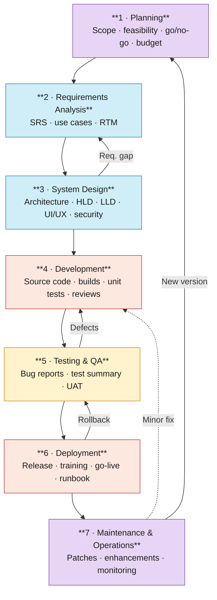

# Software Development Life Cycle (SDLC) — Reference Guide

> **Scope:** A concise but complete reference covering the history, phases, professionals, artifacts, and vocabulary of the SDLC. Intended as a portable companion document for software engineering projects.

---

## Table of Contents

1. [Historical Context](#1-historical-context)
2. [The Seven Phases](#2-the-seven-phases)
   - 2.1 [Planning](#21-planning)
   - 2.2 [Requirements Analysis](#22-requirements-analysis)
   - 2.3 [System Design](#23-system-design)
   - 2.4 [Development](#24-development)
   - 2.5 [Testing & Quality Assurance](#25-testing--quality-assurance)
   - 2.6 [Deployment](#26-deployment)
   - 2.7 [Maintenance & Operations](#27-maintenance--operations)
3. [Phase Summary Table](#3-phase-summary-table)
4. [Cycle Diagram](#4-cycle-diagram)
5. [Methodological Notes](#5-methodological-notes)
6. [Glossary](#6-glossary)
7. [References & Further Reading](#7-references--further-reading)

---

## 1. Historical Context

The concept of a structured software life cycle emerged in the **1950s and 1960s**, when organizations needed repeatable processes for building large data-processing systems on mainframes. Without structure, software projects were delivered late, over budget, or not at all — a problem later named the **Software Crisis** at the 1968 NATO Software Engineering Conference in Garmisch, Germany.

The most influential early document is Winston Royce's 1970 paper *"Managing the Development of Large Software Systems"*. It is historically ironic: Royce presented a sequential model only to argue *against* it, writing explicitly that "the implementation described above is risky and invites failure." He advocated for iterative passes through the development cycle. Nevertheless, the sequential reading of his model became the dominant paradigm for the next three decades. The term **waterfall** was never used by Royce; it was introduced by Bell and Thayer in 1976.

Key milestones in SDLC history:

| Year | Event |
|------|-------|
| 1968 | NATO Software Engineering Conference defines the Software Crisis |
| 1970 | Royce publishes the paper later misread as the Waterfall model |
| 1976 | Bell & Thayer coin the term "waterfall" |
| 1986 | Barry Boehm introduces the Spiral Model, explicitly iterative |
| 1995 | Scrum framework published by Sutherland & Schwaber |
| 2001 | Agile Manifesto published at Snowbird, Utah, by 17 practitioners |
| 2008–present | DevOps movement blurs the line between deployment and maintenance |

Today, the **phases** of the SDLC are broadly stable and recognized across methodologies. What varies is *how* the phases are sequenced (once in Waterfall, repeatedly in Agile/Scrum, concurrently in DevOps).

---

## 2. The Seven Phases

### 2.1 Planning

**Initiated by:** A business need, strategic opportunity, regulatory requirement, or executive directive.

**Objective:** Establish whether the project is worth pursuing. Define scope, high-level timeline, resource requirements, cost estimates, and risk profile. The output of this phase is a *go/no-go* decision.

**Responsible professionals:**
- Project Manager (PM)
- Business Analysts
- Product leadership / C-suite sponsors
- Financial controllers

**Output artifacts:**
- Project Charter
- Feasibility Study (technical, operational, financial)
- Risk Assessment
- High-level Project Plan
- Budget estimate

**Destination:** If approved → Requirements Analysis. If unfeasible or deprioritized → project is shelved or redesigned. For major new versions of an existing system, Maintenance loops back here.

---

### 2.2 Requirements Analysis

**Initiated by:** Approval of the Project Charter from Phase 1.

**Objective:** Elicit, document, and validate *what* the system must do (functional requirements) and *how* it must perform (non-functional requirements: performance, security, availability, scalability). Requirements must be unambiguous, measurable, and traceable.

**Responsible professionals:**
- Business Analysts (BA)
- Systems Analysts
- Product Owner (PO)
- Domain experts and end-user representatives

**Output artifacts:**
- Software Requirements Specification (SRS)
- Use Case documents or User Stories (depending on methodology)
- Requirements Traceability Matrix (RTM)

**Destination:** Signed-off SRS → System Design. Ambiguous or conflicting requirements loop back within this phase until stakeholders reach consensus.

---

### 2.3 System Design

**Initiated by:** A baselined, approved SRS.

**Objective:** Translate requirements into a concrete technical blueprint. Covers system architecture, database schema, API contracts, UI/UX wireframes, infrastructure topology, and security model. Typically split into High-Level Design (HLD) and Low-Level Design (LLD).

**Responsible professionals:**
- Software Architects
- Senior / Lead Engineers
- UX Designers
- Database Administrators (DBA)
- Security Engineers

**Output artifacts:**
- Design Document Specification (DDS)
- High-Level Design (HLD): component overview, technology stack, integration points
- Low-Level Design (LLD): class diagrams, data models, algorithm specifications
- UI/UX wireframes and prototypes

**Destination:** Approved DDS → Development. Designs that reveal requirement gaps or fail technical review return to Requirements Analysis.

---

### 2.4 Development

**Initiated by:** Approved DDS and, in Agile, a prioritized sprint backlog.

**Objective:** Write, review, and integrate the source code that implements the design. Engineers build individual components, modules, or functions, verify they work in isolation (unit tests), and integrate them progressively.

**Responsible professionals:**
- Software Engineers (frontend, backend, mobile, embedded)
- Technical Lead
- DevOps Engineers
- Database Developers

**Output artifacts:**
- Source code (version-controlled)
- Compiled builds / binaries
- Unit tests and test results
- Code review records
- Internal (inline) documentation

**Destination:** Completed, reviewed build → Testing. Code failing peer review or failing to integrate → returned to Development for rework.

---

### 2.5 Testing & Quality Assurance

**Initiated by:** A stable build delivered from Development.

**Objective:** Verify the software meets all requirements (functional and non-functional), locate and fix defects, and validate security, performance, and usability before release. Includes unit, integration, system, regression, performance, security, and user acceptance testing (UAT).

**Responsible professionals:**
- QA Engineers / Test Analysts
- Performance Engineers
- Security Testers (penetration testers)
- End users (for UAT)

**Output artifacts:**
- Test Plan and Test Cases
- Bug Reports / Defect Log
- Test Summary Report (outcome, defect status, release readiness)

**Destination:** All acceptance criteria met → Deployment. Critical defects → build returned to Development. In regulated industries, a formal audit sign-off is required before proceeding.

---

### 2.6 Deployment

**Initiated by:** A test-approved build and release authorization from the Release Manager and stakeholders.

**Objective:** Deliver the software into the production environment and integrate it into users' daily workflows. Covers installation, configuration, user notification, training, and cutover from any legacy system. The phase is complete when the system operates in production in accordance with defined requirements.

**Responsible professionals:**
- Release Manager
- DevOps / Release Engineers
- System Administrators
- Change Management team
- Training specialists

**Output artifacts:**
- Deployed production system
- Deployment Runbook (step-by-step execution guide)
- Rollback Plan
- User training materials
- Release Notes

**Destination:** Successful go-live → Maintenance. Critical production failure → rollback, return to Testing or Development.

---

### 2.7 Maintenance & Operations

**Initiated by:** System going live in production.

**Objective:** Sustain correct, secure, and efficient operation over the system's operational lifespan. Encompasses bug fixes, security patches, performance optimizations, and feature enhancements driven by user feedback and changing business needs.

**Responsible professionals:**
- Software Maintenance Team
- Release Manager (for subsequent releases)
- Support / Operations Team
- End Users (as source of feedback and change requests)

**Output artifacts:**
- Patch releases
- Updated documentation
- Incident and post-mortem reports
- Performance metrics dashboards
- Change Requests (feeding back into the cycle)

**Destination:**
- Minor fixes → Development → Testing → Deployment
- New significant features → Planning or Requirements Analysis (new cycle begins)

---

## 3. Phase Summary Table

| Phase | Initiated by | Objective | Responsible professionals | Key output artifacts | Destination |
|---|---|---|---|---|---|
| **1. Planning** | Business need or strategic directive | Scope, feasibility, go/no-go decision | PM, BA, Product leadership, Finance | Project Charter, Feasibility Study, Risk Assessment, Project Plan | Approved → Requirements; Rejected → shelved |
| **2. Requirements Analysis** | Approved Project Charter | Document what the system must do and how it must perform | BA, Systems Analyst, PO, Domain experts | SRS, Use Cases / User Stories, RTM | Signed-off SRS → Design; Gaps found → loop within phase |
| **3. System Design** | Baselined SRS | Translate requirements into a technical blueprint | Architects, Lead Engineers, UX Designers, DBA, Security | DDS (HLD + LLD), wireframes | Approved DDS → Development; Gaps → Requirements Analysis |
| **4. Development** | Approved DDS / sprint backlog | Build and integrate the source code | Software Engineers, Tech Lead, DevOps | Source code, builds, unit tests, code review records | Reviewed build → Testing; Review failure → rework |
| **5. Testing & QA** | Stable build from Development | Verify requirements, find defects, validate quality | QA Engineers, Security Testers, Performance Engineers, End Users (UAT) | Test Plan, Bug Reports, Test Summary Report | Criteria met → Deployment; Critical defects → Development |
| **6. Deployment** | Test-approved build + release authorization | Deliver software to production; integrate into workflows | Release Manager, DevOps, SysAdmins, Change Mgmt, Trainers | Deployed system, Runbook, Rollback Plan, Release Notes, Training materials | Success → Maintenance; Failure → rollback → Testing / Development |
| **7. Maintenance & Operations** | System live in production | Sustain and evolve the system over its lifespan | Maintenance Team, Release Manager, Support, End Users | Patches, updated docs, incident reports, metrics, Change Requests | Minor fix → Development; Major new version → Planning |

---

## 4. Cycle Diagram

The diagram below illustrates the primary flow (top-to-bottom) and the principal feedback loops. Left-side loops represent in-cycle corrections; the right-side loop represents the restart of a new version cycle from Maintenance.

> **Compatibility note:** Rendered as a Mermaid diagram. Supported natively in Obsidian, GitHub, GitLab, and VS Code (with the Markdown Preview Mermaid Support extension). For other renderers, the [Mermaid Live Editor](https://mermaid.live) can export the block as PNG or SVG.

---

## 5. Methodological Notes

The phases described above are methodology-agnostic. The key differences between approaches lie in *sequencing and iteration*, not in which phases exist.

| Methodology | Phase execution pattern | Key trait |
|---|---|---|
| **Waterfall** | Sequential, once | Strict phase gates; low tolerance for change |
| **Spiral** | Sequential, iterative with risk analysis per loop | Risk-driven; common in large government/defense projects |
| **Scrum (Agile)** | All phases compressed into 1–4 week sprints | Embraces changing requirements; team-centric |
| **Kanban (Agile)** | Continuous flow; no fixed sprints | Optimizes throughput; visualizes WIP limits |
| **DevOps** | Dev + Ops merged; CD pipeline automates deploy/maintain | Collapses phases 6 & 7 into a continuous delivery loop |
| **SAFe** | Agile scaled to enterprise; multiple teams, synchronized PI | Large organizations with many parallel tracks |

In practice, most modern organizations use a **hybrid**: Agile sprints for development with Waterfall-style gate reviews for architecture and compliance.

---

## 6. Glossary

| Term | Definition |
|---|---|
| **Artifact** | A formally produced document or deliverable associated with a specific SDLC phase (e.g., SRS, DDS, Test Plan). |
| **Backlog** | An ordered list of work items (features, bugs, tasks) to be addressed in future sprints; core to Scrum. |
| **Baseline** | A snapshot of an artifact formally approved and placed under change control; subsequent changes require a formal request. |
| **Change Request (CR)** | A formal proposal to modify an already-baselined artifact or deployed system. |
| **CI/CD** | Continuous Integration / Continuous Delivery — automated pipelines that build, test, and deploy code on every commit. |
| **DDS** | Design Document Specification. Comprises the HLD and LLD, describing how the system will be built. |
| **DevOps** | A culture and set of practices merging software development (Dev) and IT operations (Ops) to shorten delivery cycles. |
| **Feasibility Study** | A pre-project assessment of whether a proposed system is technically, operationally, and financially viable. |
| **HLD** | High-Level Design. Describes the system's components, their responsibilities, and how they interact — without implementation detail. |
| **LLD** | Low-Level Design. Detailed, implementation-ready specification: class diagrams, data models, algorithms. |
| **Non-functional requirement** | A constraint on *how* the system performs, rather than *what* it does (e.g., response time < 200 ms, 99.9% uptime). |
| **PO** | Product Owner. Represents stakeholder interests in Agile teams; owns and prioritizes the backlog. |
| **Post-mortem** | A structured review conducted after a production incident or project phase to identify root causes and improvements. |
| **Rollback Plan** | A documented procedure to revert a deployment to the previous stable state if a critical failure occurs. |
| **RTM** | Requirements Traceability Matrix. Maps each requirement to its design, implementation, and test coverage. |
| **Runbook** | Step-by-step operational instructions for executing a deployment or responding to a production incident. |
| **SDLC** | Software Development Life Cycle. The structured process governing how software is conceived, built, released, and retired. |
| **Sprint** | A fixed-length iteration (typically 1–4 weeks) in Scrum during which a defined set of backlog items is completed. |
| **SRS** | Software Requirements Specification. The primary output of the Requirements Analysis phase; defines what the system must do. |
| **UAT** | User Acceptance Testing. Validation performed by end users or their representatives to confirm the system meets business needs before go-live. |
| **WIP** | Work In Progress. The number of tasks currently being worked on; limiting WIP is a core Kanban principle. |

---

## 7. References & Further Reading

### Primary sources

- Royce, W. W. (1970). *Managing the Development of Large Software Systems.* Proceedings of IEEE WESCON, 26, 1–9. — The foundational paper, often misread as a Waterfall endorsement.
- Beck, K., et al. (2001). *Manifesto for Agile Software Development.* [https://agilemanifesto.org](https://agilemanifesto.org)
- Boehm, B. W. (1988). *A Spiral Model of Software Development and Enhancement.* IEEE Computer, 21(5), 61–72.
- NATO Science Committee (1968). *Software Engineering: Report on a conference sponsored by the NATO Science Committee, Garmisch, Germany.* — The conference that named the Software Crisis.

### Standards and frameworks

- **IEEE Std 12207-2017** — Systems and Software Engineering: Software Life Cycle Processes. The definitive international standard.
- **ISO/IEC/IEEE 29148:2018** — Requirements Engineering. Defines best practices for the Requirements Analysis phase.
- **NIST SP 800-64** — Security Considerations in the System Development Life Cycle. Integrates security into each SDLC phase.
- **PMBOK® Guide** (7th ed., 2021) — Project Management Body of Knowledge. Project Management Institute.

### Recommended reading

- Pressman, R. S., & Maxim, B. R. (2020). *Software Engineering: A Practitioner's Approach* (9th ed.). McGraw-Hill. — Standard university reference; covers all SDLC phases in depth.
- Sommerville, I. (2016). *Software Engineering* (10th ed.). Pearson. — Another comprehensive academic reference with strong coverage of requirements and design.
- Kim, G., Humble, J., Debois, P., & Willis, J. (2016). *The DevOps Handbook.* IT Revolution Press. — Practical guide to collapsing the deployment/maintenance boundary.
- Cohn, M. (2004). *User Stories Applied.* Addison-Wesley. — Definitive reference for Agile requirements in the form of user stories.
- Brooks, F. P. (1975, revised 1995). *The Mythical Man-Month.* Addison-Wesley. — Classic essays on software project management; still deeply relevant.

---

*Document version 1.0 — Compiled June 2026*
